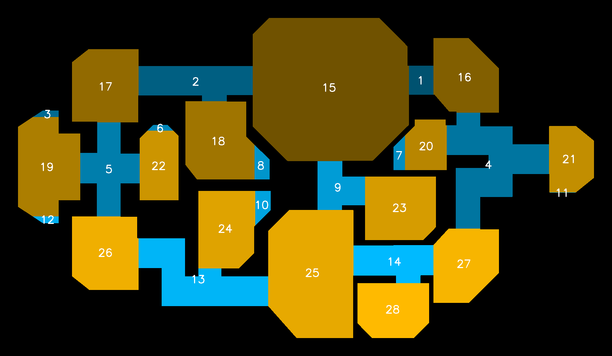

# floorplan-labeling

motivating discussion and source data:

https://forum.opencv.org/t/static-labels-in-watershed/1857

# problem statement

a floorplan is given where rooms and corridors are white, everything else is black.

figure out what is "room" and what is "corridor".

# approach

1. morphology to find caverns ("rooms")

   proper kernel and number of iterations are tricky.
   in general, use a round kernel, not a rectangular one.
   if things are upright and perfectly in line, a rectangular kernel will do better.

2. calculate corridors, which are non-rooms.

3. label all components.

3. this is now a graph. rooms/corridors are nodes. calculate room/corridor interfaces (edges).

4. assign dead-end corridors to their connected room.

